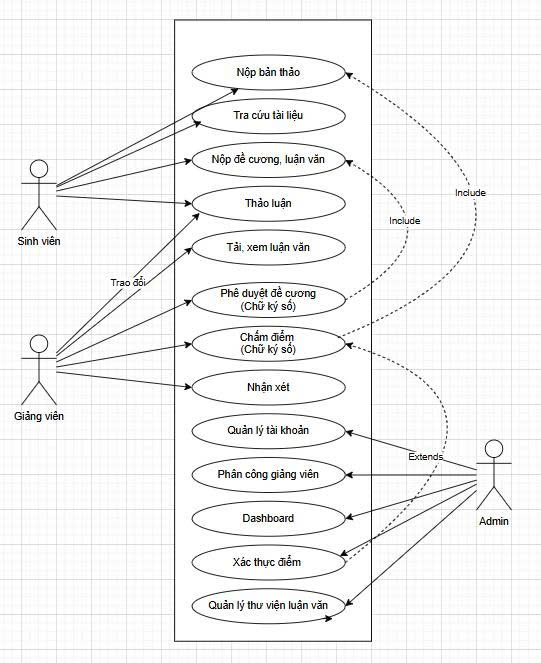
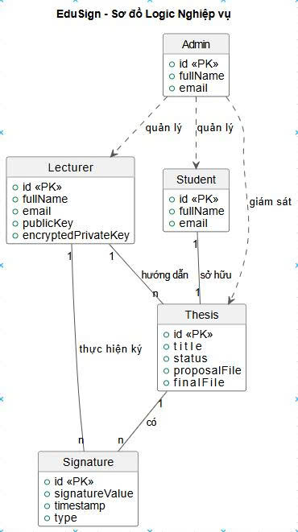
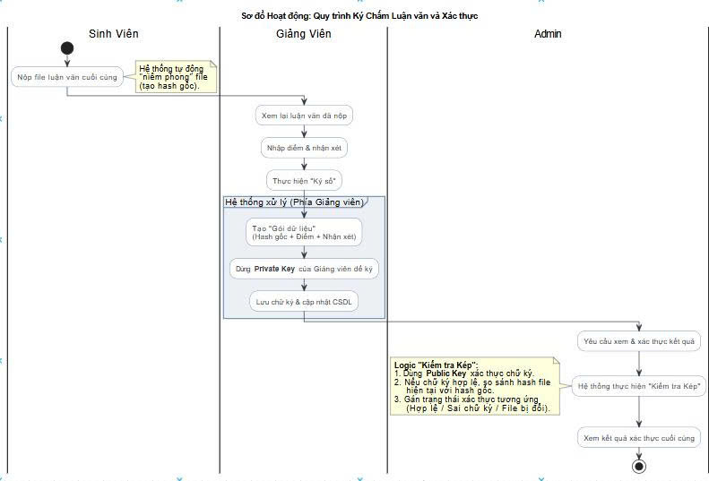
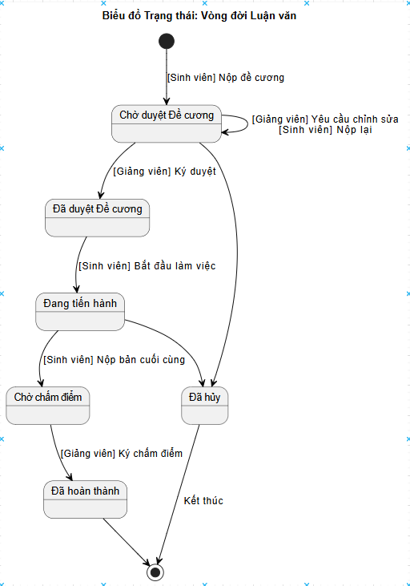

  

  <!-- Stars -->
  
  
  <!-- Forks -->
  
  
  <!-- Issues -->
  
  
  <!-- License -->
  

# ✍️ Project EduSign: Hệ Thống Quản Lý & Phê Duyệt Luận Văn Tốt Nghiệp

Một dự án ứng dụng web được xây dựng với **Node.js (Express.js)** và **MySQL**, mô phỏng một hệ sinh thái quản lý học thuật toàn diện. Dự án áp dụng các công nghệ hiện đại như **Chữ ký số** để đảm bảo tính pháp lý và **Xác thực Sinh trắc học** để nâng cao bảo mật.

| **Môn học:** | **Phân tích và Thiết kế Phần mềm** |
| :--- | :--- |
| **Nhóm:** | **05** |
| **Giảng viên Hướng dẫn:** | ThS. Vũ Quang Dũng |
| **Giảng viên Hướng dẫn:** | Ths. Nguyễn Xuân Quế |

### **Thành viên Nhóm (Team Members)**

| **STT** | **Họ và Tên** | **Mã Sinh Viên** | **Vai trò (Role)** |
| :---: | :--- | :---: | :--- |
| 1 | Nguyễn Thọ Nhân | 23010786 | Team Leader, Backend Developer |
| 2 | Nguyễn Xuân Chức| 23010452| Frontend Developer, UI/UX Designer |
| 3 | Phạm Anh Thái | 23010784 | Business Analyst, Tester |
| 4 | Lê Tuấn Anh | 21011577 | Database Engineer, DevOps |
---

## 🚀 Giới Thiệu Dự Án (Project Introduction)

**EduSign** không chỉ là một hệ thống nộp bài và chấm điểm đơn thuần. Dự án này được phát triển nhằm giải quyết các bài toán cốt lõi trong quy trình học thuật, đặc biệt là vấn đề **đảm bảo tính toàn vẹn, tính xác thực và chống chối bỏ** trong các khâu phê duyệt quan trọng. Bằng việc áp dụng thuật toán chữ ký số sử dụng cặp khóa Bất đối xứng (Public/Private Key), hệ thống có khả năng xác minh rằng các quyết định phê duyệt và điểm số của giảng viên là không thể bị thay đổi và được xác thực một cách chính xác.

Bên cạnh đó, dự án tập trung vào việc xây dựng một trải nghiệm người dùng liền mạch và an toàn. **EduSign** tích hợp phương thức xác thực sinh trắc học hiện đại (WebAuthn API), mang lại một lớp bảo mật mạnh mẽ nhưng vẫn thân thiện với người dùng. Với các tính năng hỗ trợ như kênh thảo luận trực tiếp, thư viện tham khảo và công cụ gợi ý đề tài bằng AI, EduSign hướng tới mục tiêu trở thành một nền tảng quản lý luận văn toàn diện, minh bạch và hiệu quả.

---
## 📋 Tài liệu Mô tả Yêu cầu Hệ thống (System Requirements Document - SRD)
### I. Yêu cầu Chức năng (Functional Requirements)
👤 **Account & Security Management**
- Đăng ký/nhập đa vai trò (Student, Lecturer, Admin), hỗ trợ xác thực sinh trắc học.
- Quản lý hồ sơ cá nhân và tự động tạo/bảo vệ cặp khóa (Public/Private Key) cho việc ký số.
✍️ **Core Thesis Workflow**
- Quy trình nộp luận văn nhiều giai đoạn (đề cương, bản thảo, bản cuối).
- Giảng viên nhận xét, phê duyệt và chấm điểm bằng Chữ ký số để đảm bảo tính pháp lý và toàn vẹn.
- Theo dõi trạng thái và lịch sử phê duyệt của luận văn một cách minh bạch.
💬 **Interaction & Support Features**
- Kênh thảo luận riêng cho từng dự án, thư viện tham khảo với bộ lọc nâng cao.
- Hỗ trợ sinh viên bằng công cụ gợi ý đề tài (AI) và các mẫu luận văn (templates) có sẵn.
👑 **Administration & Reporting**
- Dashboard trực quan hiển thị các số liệu thống kê quan trọng cho Admin.
- Quản lý toàn diện (CRUD) tài khoản người dùng và các luận văn trong thư viện.
### II. Yêu cầu Phi chức năng (Non-Functional Requirements)
- 🔒 **Security**: Mã hóa toàn diện từ dữ liệu truyền tải (HTTPS) đến lưu trữ (hashed passwords, encrypted keys).
- ⚡ **Performance**: Phản hồi nhanh (<2s) và xử lý hiệu quả các tệp tin lớn.
- ✨ **Usability**: Giao diện trực quan, thân thiện và tương thích trên nhiều thiết bị (responsive).
- 🛡️ **Data Integrity**: Đảm bảo tính toàn vẹn của file gốc và các quyết định phê duyệt qua hashing và chữ ký số

---
## 📊 Sơ Đồ Thiết kế Hệ thống (System Design Diagrams)

Phần này trực quan hóa kiến trúc và luồng hoạt động của dự án EduSign thông qua các biểu đồ UML.

### a. 🧠 Sơ đồ Usecase (Usecase Diagram)

Sơ đồ thể hiện các tác nhân (Actors) và các chức năng chính họ có thể thực hiện trên hệ thống EduSign.

.

*Sơ đồ minh họa sự tương tác của Sinh viên, Giảng viên, và Admin với các chức năng cốt lõi như Nộp bài, Ký số, và Quản lý hệ thống.*

---

### 🏗️ Sơ Đồ Cấu Trúc (Class Diagram)

Biểu đồ Lớp mô tả cấu trúc dữ liệu và các đối tượng chính của hệ thống.

.

*Sơ đồ minh họa các đối tượng chính (`User`, `Thesis`, `Signature`, `Comment`) và các mối quan hệ giữa chúng (One-to-Many, Many-to-Many).*

---

### ⚙️ Sơ Đồ Thuật Toán (Activity Diagram)

Sơ đồ này mô tả chi tiết luồng công việc (workflow) của chức năng quan trọng nhất: Ký chấm luận văn và Xác thực.

.

*Sơ đồ thể hiện các bước từ khi Sinh viên nộp bài, Giảng viên thực hiện ký số, cho đến khi Admin vào xác thực kết quả cuối cùng.*

---

## 💻 Biểu đồ trạng thái

Biểu đồ này mô tả vòng đời và các trạng thái mà một đối tượng `Thesis` (Luận văn) có thể trải qua.

.

*Sơ đồ minh họa quá trình chuyển đổi trạng thái của một luận văn, từ lúc "Chờ duyệt Đề cương" cho đến khi "Đã hoàn thành" hoặc "Đã hủy".*

---

## 📸 Ảnh Chụp Màn Hình Chức Năng Chính

| Trang Đăng nhập & Xác thực Sinh trắc học | Dashboard Sinh viên & Tiến độ Luận văn |
| :------------------------------: | :----------------------------------: |
| ****         | ****    |
| **Giao diện Chấm điểm của Giảng viên**              | **Dashboard Quản Trị của Admin**   |
| ****         | ****        |
| **Luồng Thảo luận & Phản hồi**     | **Xem Lịch sử & Xác thực Chữ ký số**     |
| ****         | ****         |

---

### 🔗 Liên Kết
- Link Repository: [https://github.com/NguyenThoNhan/PTTKPM25-26_ClassN05_Nhom5]
- Link Deploy: [https://edusign-app.onrender.com]
- Link Readme.io: [https://nguyenthonhan.github.io/edusign_readme/]

## 🛠️ Công nghệ Sử dụng (Technology Stack)

