

# 📖 Project BookHaven: Hệ Thống Quản Lý Thư Viện Tích Hợp Chữ Ký Số

Một dự án ứng dụng web được xây dựng trên nền tảng Laravel 10, mô phỏng một hệ thống quản lý thư viện số hiện đại với các tính năng nâng cao như phân quyền, chữ ký số bất đối xứng, và trải nghiệm người dùng tương tác.

| **Môn học:** | **Phân tích và Thiết kế Phần mềm** |
| :--- | :--- |
| **Nhóm:** | **05** |
| **Giảng viên Hướng dẫn:** | ThS. Vũ Quang Dũng |
| **Giảng viên Hướng dẫn:** | Ths. Nguyễn Xuân Quế |

### **Thành viên Nhóm (Team Members)**

| **STT** | **Họ và Tên** | **Mã Sinh Viên** | **Vai trò (Role)** |
| :---: | :--- | :---: | :--- |
| 1 | Nguyễn Thọ Nhân | 23010786 | Team Leader, Backend Developer |
| 2 | Nguyễn Xuân Chức| 23010452| Frontend Developer, UI/UX Designer |
| 3 | Phạm Anh Thái | 23010784 | Business Analyst, Tester |
| 4 | Lê Tuấn Anh | 21011577 | Database Engineer, DevOps |
---

## 🚀 Giới Thiệu Dự Án (Project Introduction)

**BookHaven** không chỉ là một hệ thống quản lý thư viện truyền thống. Dự án này được phát triển nhằm giải quyết bài toán cốt lõi trong thư viện số: **đảm bảo tính toàn vẹn và xác thực nguồn gốc của tài liệu điện tử** trong suốt quá trình mượn và trả. Bằng việc áp dụng thuật toán chữ ký số RSA-SHA256, hệ thống có khả năng xác minh rằng mỗi tài liệu được mượn đều được ký số một cách duy nhất, đảm bảo không thể bị thay đổi và gắn liền với danh tính của người mượn.

Bên cạnh đó, dự án tập trung vào việc cách mạng hóa trải nghiệm đọc sách, biến nó từ một hoạt động cá nhân thành một hành trình cộng đồng đầy hứng khởi. **BookHaven** tích hợp các cơ chế **Gamification** (hệ thống điểm thưởng, huy hiệu, thử thách) và các tính năng xã hội (nhóm đọc, thảo luận) để thúc đẩy và duy trì thói quen đọc. Với các công nghệ truy cập hiện đại như **quét mã QR và Progressive Web App (PWA)** cho phép đọc ngoại tuyến, BookHaven hướng tới mục tiêu trở thành một nền tảng thư viện số toàn diện, bảo mật, và có tính tương tác cao.

## ✨ Các Tính Năng Nổi Bật

### 1. Kiến Trúc và Mô Hình Hóa Dữ Liệu
-   🏛️ **Nền tảng Laravel 10:** Toàn bộ ứng dụng được xây dựng trên phiên bản mới nhất của Laravel Framework, tận dụng các tính năng hiện đại như Vite, Eloquent ORM, và hệ thống Routing mạnh mẽ.
-   🗃️ **Mô Hình Hóa Đa Đối Tượng:** Hệ thống mô hình hóa và quản lý mối quan hệ phức tạp giữa **6 đối tượng chính**: `User`, `Book`, `Loan`, `Category`, `Event` và `Badge`, `Review`, `Discussion` và `ReadingGroup` Các mối quan hệ (One-to-Many, Many-to-Many) được định nghĩa chặt chẽ thông qua Eloquent.
-   ☁️ **Database Migration trên Cloud:** Áp dụng kỹ thuật Eloquent Migrations để định nghĩa, phiên bản hóa và triển khai cấu trúc cơ sở dữ liệu một cách tự động và an toàn, trực tiếp lên một dịch vụ CSDL trên Cloud (Aiven for MySQL).
-   
### 2. Chức năng chính:
-   👤 **Hệ thống Xác thực & Phân quyền:** Phân chia rõ ràng vai trò `Admin` và `User` với các quyền hạn riêng biệt.
-   📚 **Quản lý Tài nguyên (CRUD):** Xây dựng một giao diện quản trị CRUD (Create, Read, Update, Delete) hoàn chỉnh cho các đối tượng cốt lõi như **Sách (`Book`)**, **Danh mục (`Category`)**, và **Sự kiện (`Event`)**.
-   💻 **Quản lý Tài liệu Online:** Cho phép Admin upload file `.txt` làm nội dung cho tài liệu điện tử.
-   ✍️ **Chữ Ký Số Bất Đối Xứng:** Tự động ký lên tài liệu online bằng **Private Key** khi người dùng mượn và xác thực bằng **Public Key** khi trả, đảm bảo tính toàn vẹn tuyệt đối.
-   👥 **Quản lý Người dùng & Lượt mượn:** Admin có thể theo dõi và quản lý toàn bộ người dùng và các hoạt động mượn/trả trong hệ thống.
-   🎉 **Quản lý Sự kiện:** Admin có thể tạo và quản lý các sự kiện của thư viện.
-   💻 **Quản lý mail liên hệ, hỏi đáp:** Admin thông qua mailtrap.io trả lời tư vấn cho khách hàng.
-   🔔 **Hệ thống Thông báo Tự động**: Tự động xử lý và gửi 8 loại thông báo khác nhau (sắp đến hạn, quá hạn, review mới,...) qua email (Mailtrap.io) và thông báo trong ứng dụng (in-app notification).
-   💬 **Quản lý Cộng đồng**: Cung cấp công cụ cho Admin để kiểm duyệt các bài thảo luận, quản lý các nhóm đọc sách và người dùng.

### 3. Trải Nghiệm Người Dùng Tương Tác:
-   🚀 **Mượn/Trả tài liệu:** Người dùng mượn/trả tài liệu on/off với chữ ký số.
-   ❤️ **Tủ sách Yêu thích:** Lưu lại những cuốn sách quan tâm để xem sau.
-   📱 **Truy Cập Nhanh bằng Mã QR**: Mỗi cuốn sách có một mã QR duy nhất, cho phép người dùng quét để xem thông tin và mượn sách chỉ với một cú nhấp.
-   🏆 **Hệ Thống Gamification Toàn Diện**: Tích hợp hệ thống điểm kinh nghiệm (XP), cấp độ, chuỗi ngày đọc, huy hiệu, thử thách hàng ngày và bảng xếp hạng để tạo động lực và duy trì thói quen đọc.
-   👥 **Tương Tác Cộng Đồng Sôi Nổi**: Người dùng có thể đánh giá, review sách, tạo và tham gia các nhóm đọc, cũng như thảo luận trên một dòng thời gian (social feed) chung.
-   🌐 **PWA & Đọc Offline**: Khả năng cài đặt BookHaven lên thiết bị như một ứng dụng gốc (Progressive Web App) và tải sách về để đọc ngay cả khi không có kết nối internet.
-   📅 **Đăng ký Sự kiện:** Xem và đăng ký tham gia các sự kiện do thư viện tổ chức.
-   🏛️ **Thư viện ảo 3D:** Một không gian 3D tương tác, cho phép người dùng "dạo bước" và khám phá các kệ sách như trong một thư viện thực thụ.
-   💻 **Liên hệ và hỏi đáp:** Người dùng liên hệ với quản trị viên thông qua mailtrap.io

### 4. Bảo Mật Toàn Diện (Security)
-   🔑 **Định danh & Xác thực (`Authentication`):** Tích hợp `Laravel Breeze` cung cấp một hệ thống đăng ký, đăng nhập, và quản lý phiên (session) an toàn, tuân thủ các chuẩn bảo mật hiện đại.
-   🛡️ **Phân quyền (`Authorization`):** Sử dụng `Gates` và `Policies` của Laravel để định nghĩa các quy tắc truy cập chặt chẽ, đảm bảo người dùng chỉ có thể thực hiện các hành động được phép trên dữ liệu của chính mình hoặc theo vai trò được gán.
-   📝 **An toàn Dữ liệu Đầu vào:**
    -   **Chống CSRF:** Mọi form `POST`, `PATCH`, `DELETE` đều được bảo vệ bằng token `@csrf`.
    -   **Xác thực Dữ liệu (`Validation`):** Tất cả dữ liệu gửi lên từ người dùng đều được kiểm tra nghiêm ngặt bằng `Request Validation` trước khi xử lý.
-   🔒 **An toàn Dữ liệu Đầu ra và Lưu trữ:**
    -   **Chống XSS:** Dữ liệu xuất ra view được tự động escape bởi cú pháp `{{ }}` của Blade.
    -   **Chống SQL Injection:** Eloquent ORM sử dụng Parameter Binding, loại bỏ hoàn toàn nguy cơ tấn công SQL Injection.
    -   **Chữ Ký Số Bất Đối Xứng:** Áp dụng thuật toán RSA-SHA256 với cặp khóa Private/Public để ký và xác thực tính toàn vẹn của tài liệu, một cấp độ bảo mật cao hơn so với HMAC.

## 5. 🛠️ Công Nghệ Sử Dụng

-   **Backend:** Laravel 10, PHP 8.1+
-   **Frontend:** Blade, JavaScript (ES6+), CSS 3D Transforms
-   **Database:** MySQL (Kết nối và Migrate tới Aiven Cloud)
-   **Authentication:** Laravel Breeze
-   **Core Technologies:** Eloquent ORM, Artisan Commands, Middlewares, Policies, Events & Listeners.
---
## 📊 Sơ Đồ Thiết kế Hệ thống (System Design Diagrams)

Phần này trực quan hóa kiến trúc và luồng hoạt động của dự án EduSign thông qua các biểu đồ UML.

### a. 🧠 Sơ đồ Usecase (Usecase Diagram)

Sơ đồ thể hiện các tác nhân (Actors) và các chức năng chính họ có thể thực hiện trên hệ thống BookHaven.

**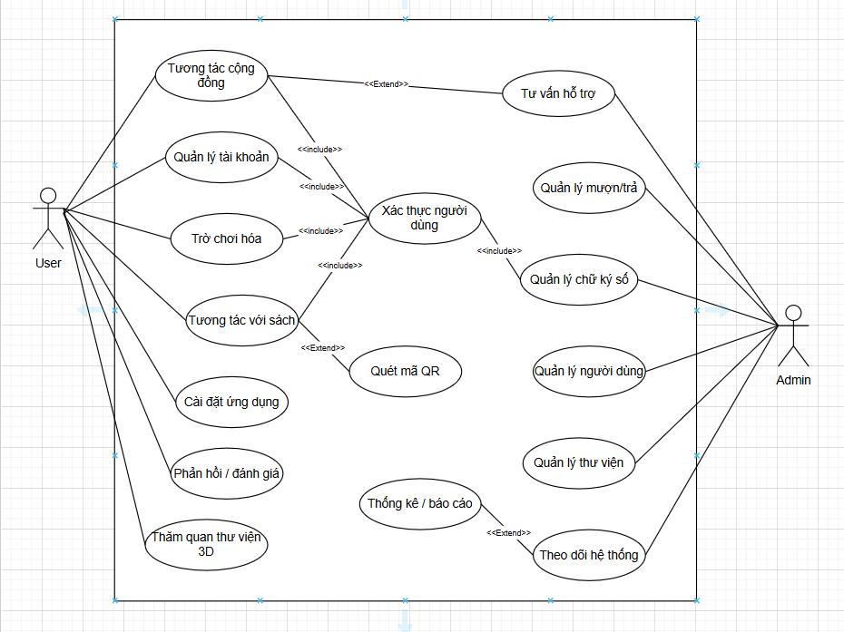**

*Sơ đồ minh họa sự tương tác của User và Admin với các chức năng cốt lõi như Mượn/Trả sách, Ký số, Gamification, Tương tác cộng đồng, và Quản lý hệ thống.*

---

### 🏗️ Sơ Đồ Cấu Trúc (Class Diagram)

Biểu đồ Lớp mô tả cấu trúc dữ liệu và các đối tượng chính của hệ thống.

****

*Sơ đồ minh họa các đối tượng chính (`User`, `Book`, `Loan`, `Event`, `Category`, `Badge`, `Review`, `Discussion`) và các mối quan hệ giữa chúng (One-to-Many, Many-to-Many).*

---

### ⚙️ Sơ Đồ Thuật Toán (Activity Diagram)

#### Sơ đồ 1: Quy trình Xác thực Tính toàn vẹn của Tài liệu Online

**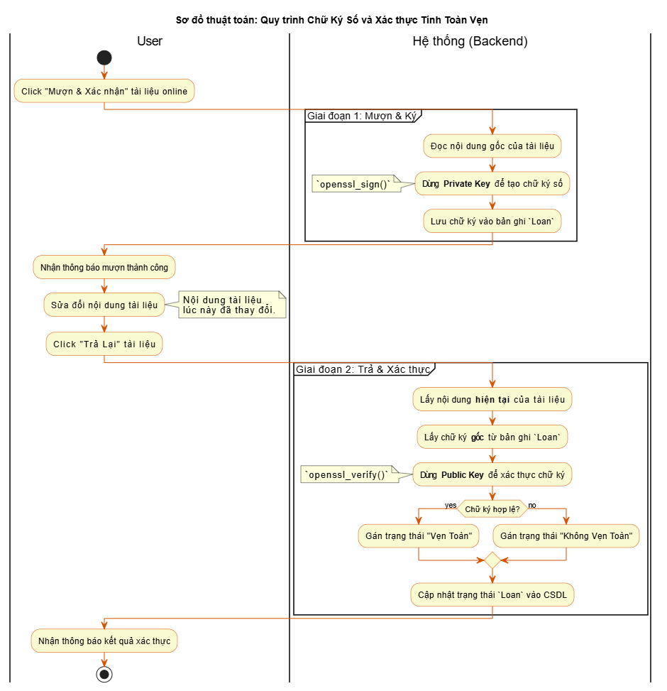**

*Sơ đồ mô tả các bước từ khi người dùng mượn tài liệu, hệ thống ký bằng Private Key, người dùng sửa đổi nội dung, cho đến khi trả lại và hệ thống xác thực bằng Public Key.*

#### Sơ đồ 2: Quy trình Tự động Trao huy hiệu cho Người dùng

**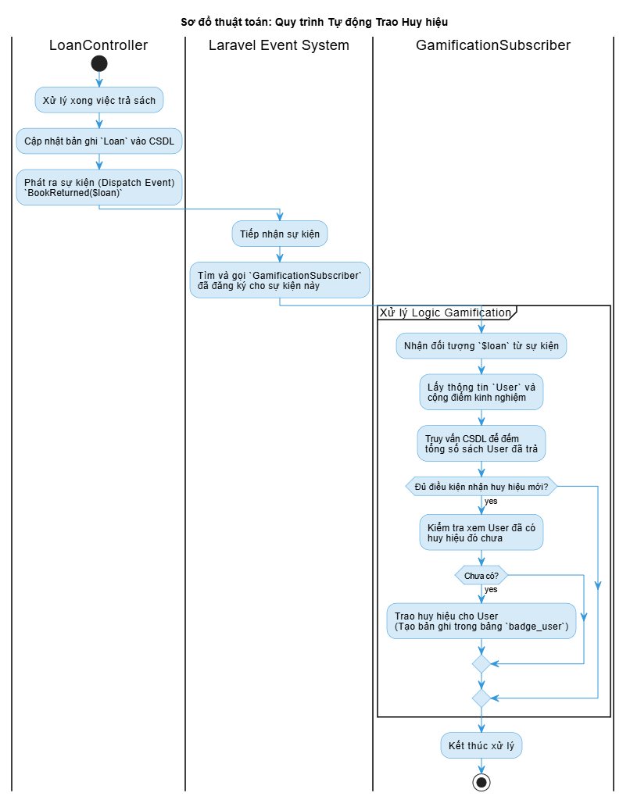**

*Sơ đồ mô tả luồng hoạt động của hệ thống Event-Listener: Sự kiện `BookReturned` được phát ra, `GamificationSubscriber` lắng nghe, thực hiện truy vấn để đếm số sách đã mượn và kiểm tra điều kiện để trao huy hiệu "Độc Giả Chăm Chỉ".*

---

## 💻 Biểu đồ Trạng thái (State Diagram)

Biểu đồ này mô tả vòng đời và các trạng thái mà một đối tượng Book có thể trải qua trong suốt quá trình.

**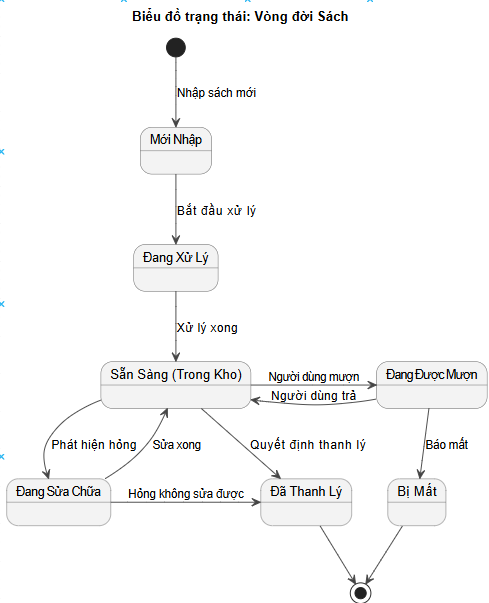**

*Sơ đồ minh họa quá trình chuyển đổi trạng thái của một lượt mượn, từ lúc "Đang chờ duyệt" cho đến khi "Hoàn thành", "Quá hạn" hoặc "Đã hủy".*

---

## 📸 Ảnh Chụp Màn Hình Chức Năng Chính

| Trang giao diện lưới sách | Dashboard Quản trị của Admin |
| :------------------------------: | :----------------------------------: |
| **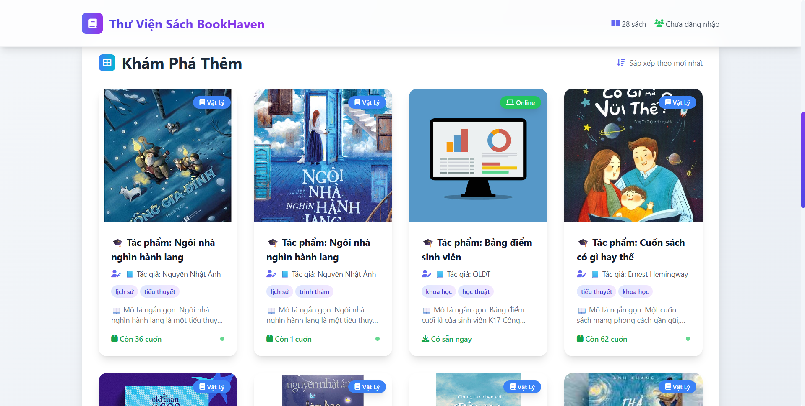**         | **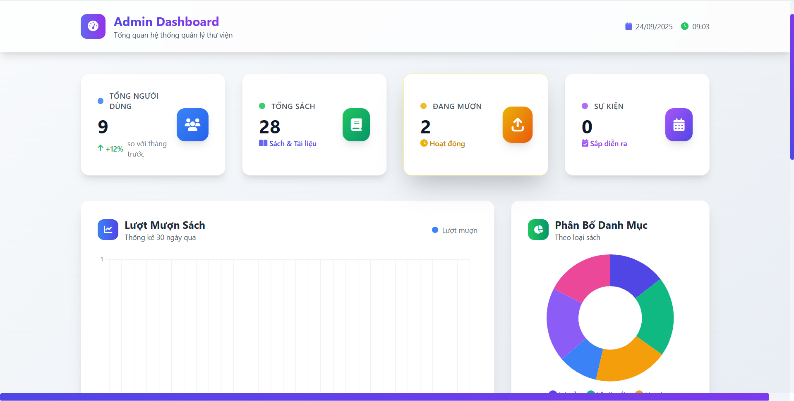**    |
| **Giao diện Chi tiết sách**              | **Giao diện Gamification**   |
| **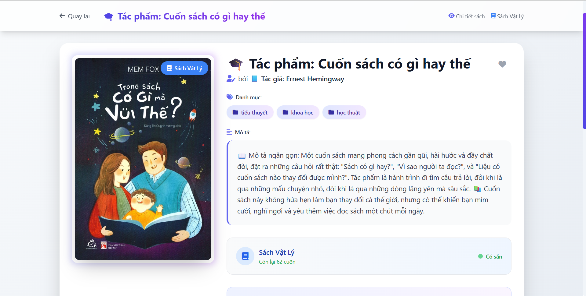**         | **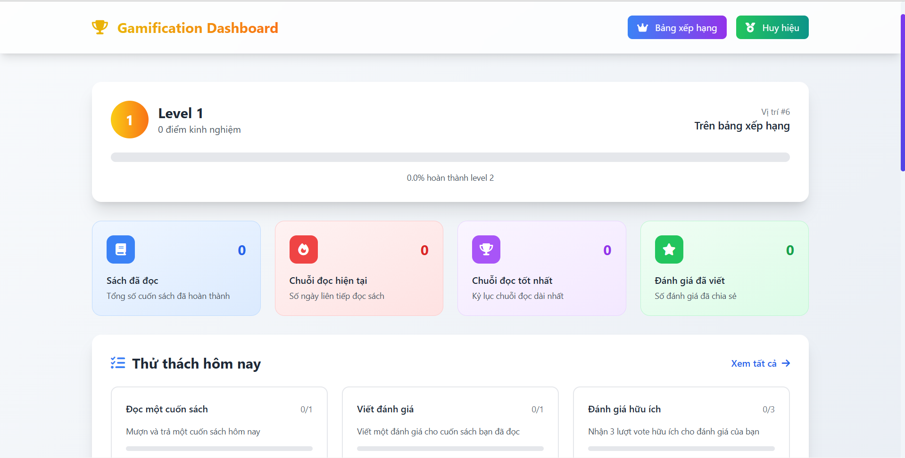**        |
| **Luồng Thảo luận & Phản hồi**     | **Giao diện thư viện 3D**     |
| **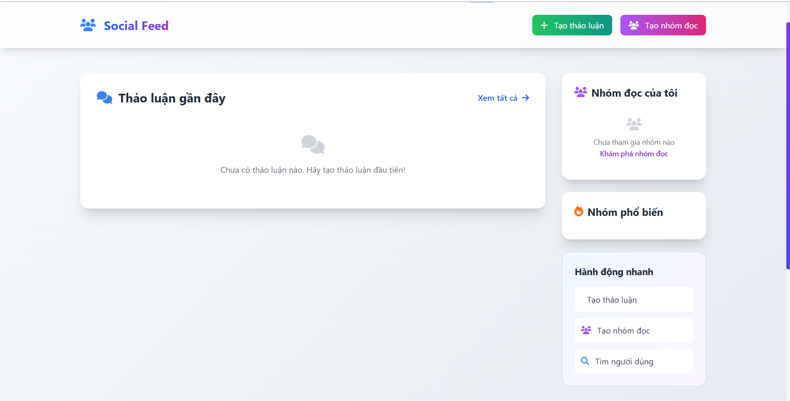**         | **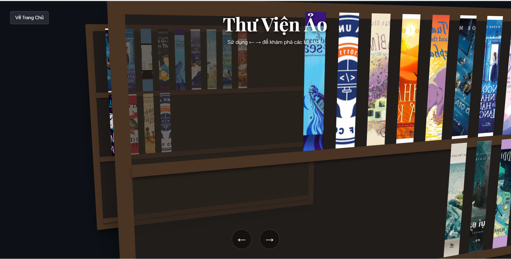**         |
| **Giao diện trang cá nhân**     | **Giao diện quản lý mượn / trả**     |
| **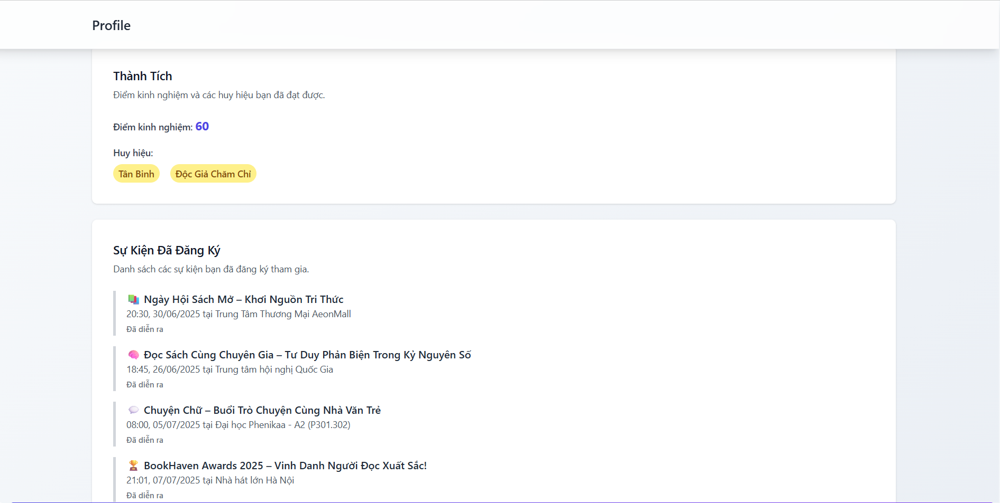**         | **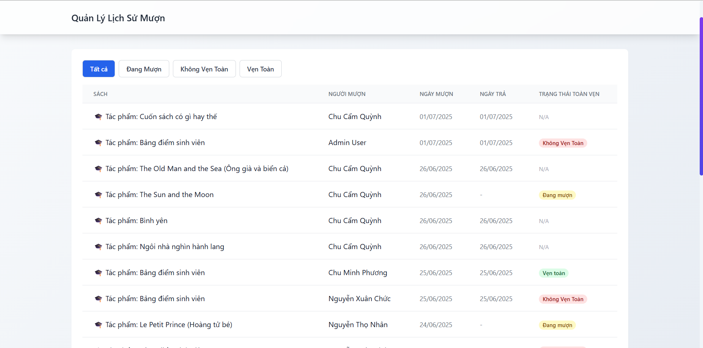**         |

---

### 🔗 Liên Kết
- Link Repository: [https://github.com/NguyenThoNhan/PTTKPM25-26_ClassN05_Nhom5]
- Link Deploy: [https://bookhaven-app.onrender.com]
- Link Readme.io: [https://nguyenthonhan.github.io/bookhaven_readme/]
